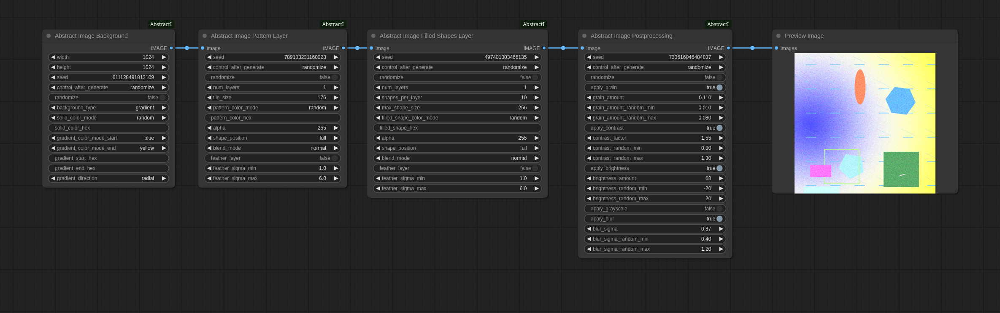
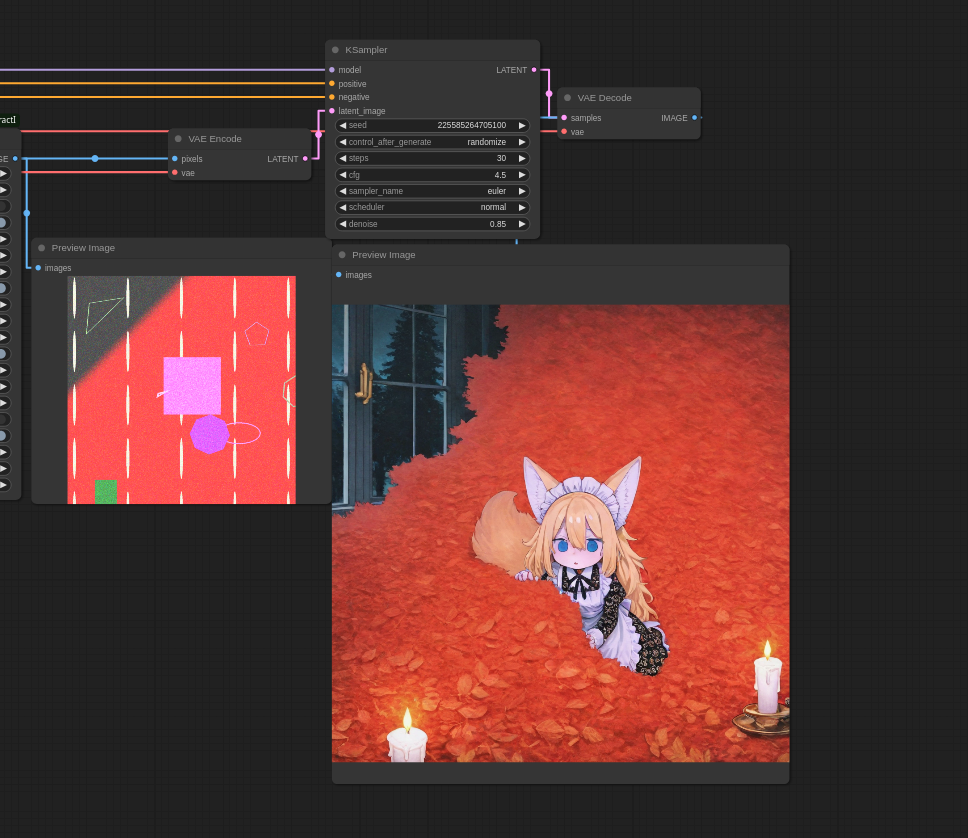
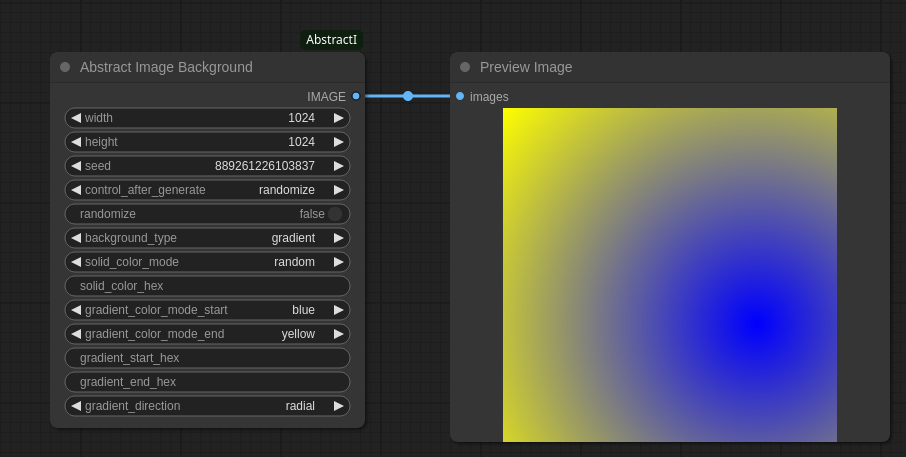
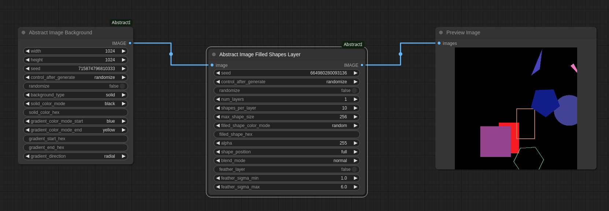
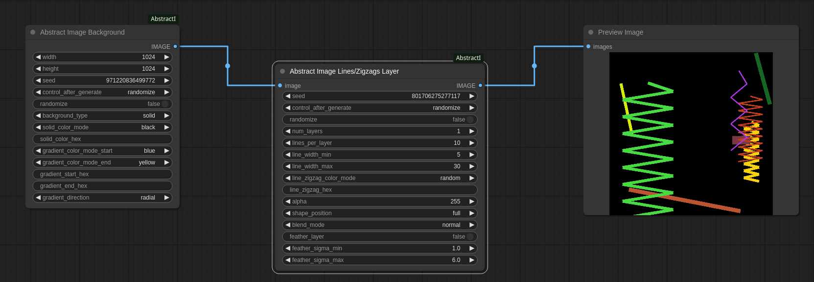
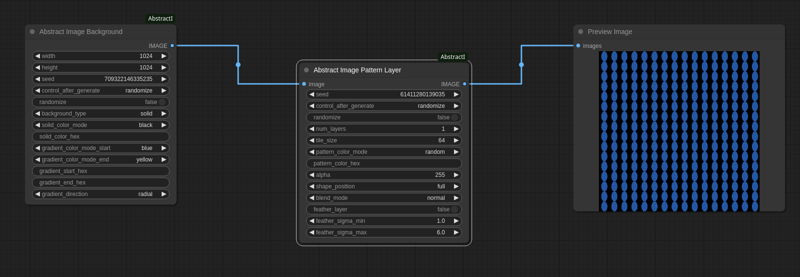
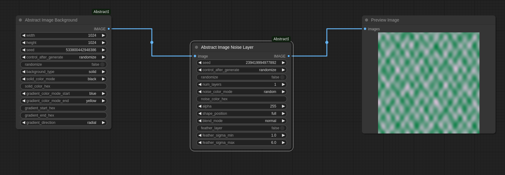
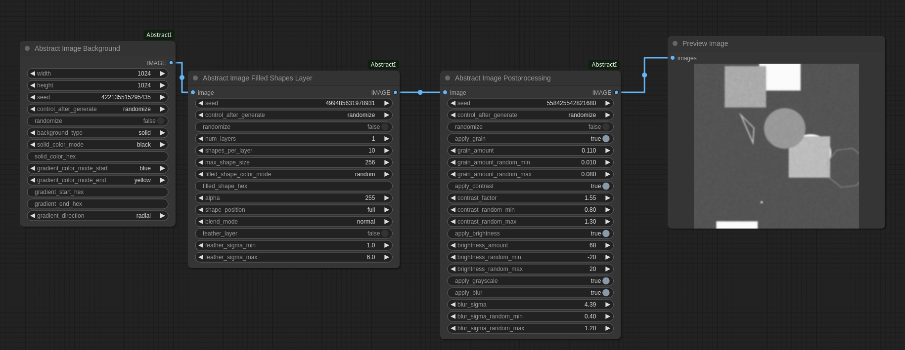
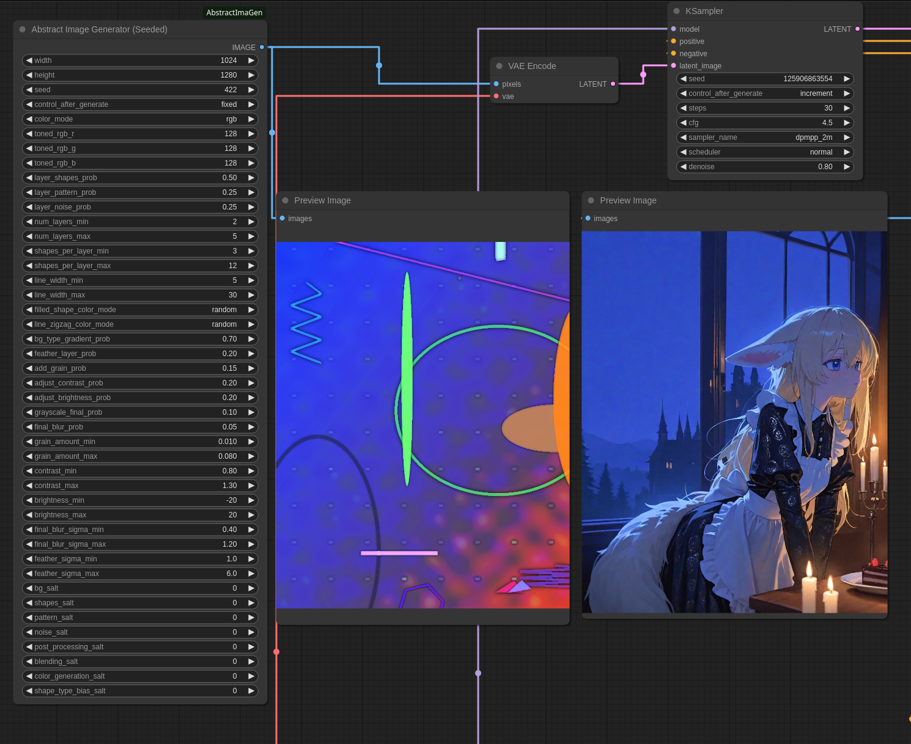
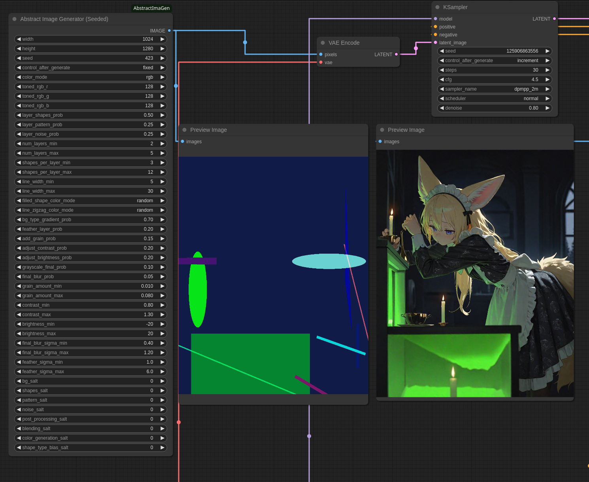

# ComfyUI Abstract Image Generator

A custom node collection for ComfyUI that generates abstract images with comprehensive seed-based control over layers, shapes, patterns, noise, colors, and post-processing effects.

This node collection is designed to create unique abstract base images on the fly within your ComfyUI workflows, which can then be used as input for VAE encoding, image-to-image generation, or other creative processes.

## Workflow

This image can be loaded into ComfyUI as a workflow

 

# V2

A custom node pack for ComfyUI, providing modular components to generate abstract images with enhanced user control. This pack was created by splitting functionalities from the original abstract image generator into dedicated nodes for greater flexibility and customization.

## Nodes Included

This pack includes the following nodes:

* **[Abstract Image Background](#abstract-image-background):** Generate a base solid color or gradient background.
* **[Abstract Image Filled Shapes Layer](#abstract-image-filled-shapes-layer):** Add a layer of filled shapes (rectangles, ellipses, triangles, polygons).
* **[Abstract Image Lines/Zigzags Layer](#abstract-image-lineszigzags-layer):** Add a layer of lines and zigzag patterns.
* **[Abstract Image Pattern Layer](#abstract-image-pattern-layer):** Add a layer of repeating tiled patterns.
* **[Abstract Image Noise Layer](#abstract-image-noise-layer):** Add a layer of noise patterns.
* **[Abstract Image Postprocessing](#abstract-image-postprocessing):** Apply various post-processing effects to an image.


## Usage

These nodes are designed to be chained together in a ComfyUI workflow. A typical workflow would look like this:

1.  Start with the **Abstract Image Background** node to create the base image.
2.  Connect the output image of the background node to the `image` input of one or more layer nodes (**Abstract Image Filled Shapes Layer**, **Abstract Image Lines/Zigzags Layer**, **Abstract Image Pattern Layer**, **Abstract Image Noise Layer**). You can stack multiple layer nodes to build up complexity.
3.  Connect the output image of the final layer node (or the background node if no layers are used) to the `image` input of the **Abstract Image Postprocessing** node to apply final adjustments.
4.  Connect the output of the Postprocessing node to a "VAE Encode" or other output node.

Each node offers various parameters to control the appearance of the generated elements, including randomization toggles for quick variations based on the seed.

 

## Installation

### ComfyUI-Manager (Recommended)

1.  Open ComfyUI manager
2.  Click on "Custom Nodes Manager"
3.  Search for AbstractImaGen
4.  Install it
5.  Restart and refresh the browser window
6.  The node will be found udner the AbstractImage category when adding a node

### Manual Installation (Not Recommended)
1.  Navigate to your ComfyUI installation directory.
2.  Go into the `custom_nodes` folder.
3.  Open a terminal and run
    ```bash
    git clone https://github.com/wakattac/ComfyUI-AbstractImaGen
    ```
5.  If you have a Python environment set up for ComfyUI, you can install the dependencies listed in `requirements.txt` (though most are likely already installed with ComfyUI).
   
    Linux:
    ```bash
    cd ../..
    source venv/bin/activate
    cd path/to/comfyui/custom_nodes/ComfyUI-AbstractImaGen
    pip install -r requirements.txt
    ```
    Windows:
    ```powershell
    cd ..\..
    venv\Scripts\activate
    cd path\to\comfyui\custom_nodes\ComfyUI-AbstractImaGen
    pip install -r requirements.txt
    ```
7.  Restart ComfyUI.

You should now find the node under the "AbstractImage" category in the add node menu.


## Node Descriptions

### Abstract Image Background

Generates a base image that can be a solid color or a gradient.

 

* **Inputs:**
    * `width`, `height`: Image dimensions.
    * `seed`: Seed for random background generation (especially for gradient direction and randomized colors).
    * `randomize`: If true, randomizes background type, colors, and gradient direction.
    * `background_type`: Choose `solid` or `gradient`.
    * `solid_color_mode`: Color selection mode for solid background (random, specific colors).
    * `solid_color_hex`: Optional hex code for solid color (overrides mode if valid).
    * `gradient_color_mode_start`, `gradient_color_mode_end`: Color selection modes for gradient start and end colors.
    * `gradient_start_hex`, `gradient_end_hex`: Optional hex codes for gradient start/end (override modes).
    * `gradient_direction`: Direction of the gradient (vertical, horizontal, radial, diagonal).
* **Output:** `IMAGE`

### Abstract Image Filled Shapes Layer

Adds a layer of randomized filled shapes to an existing image.

 

* **Inputs:**
    * `image`: Input image tensor.
    * `seed`: Seed for randomness within this layer.
    * `randomize`: If true, randomizes shapes per layer, colors, size, position, and blend mode.
    * `num_layers`: Number of shape sub-layers to add.
    * `shapes_per_layer`: Number of shapes to draw in each sub-layer.
    * `max_shape_size`: Maximum size of a single shape.
    * `filled_shape_color_mode`: Color selection mode for filled shapes (random, hex, specific colors).
    * `filled_shape_hex`: Optional hex code for filled shapes color.
    * `alpha`: Transparency of the shapes (0-255).
    * `shape_position`: Restrict shapes to a specific area (full, quadrants, center).
    * `blend_mode`: Blending mode for compositing the layer.
    * `feather_layer`: Apply Gaussian blur to the layer's alpha channel.
    * `feather_sigma_min`, `feather_sigma_max`: Range for feathering blur amount.
* **Output:** `IMAGE`

### Abstract Image Lines/Zigzags Layer

Adds a layer of randomized lines and zigzag patterns to an existing image.

 

* **Inputs:**
    * `image`: Input image tensor.
    * `seed`: Seed for randomness within this layer.
    * `randomize`: If true, randomizes lines per layer, colors, width, position, and blend mode.
    * `num_layers`: Number of line/zigzag sub-layers to add.
    * `lines_per_layer`: Number of lines/zigzags to draw in each sub-layer.
    * `line_width_min`, `line_width_max`: Minimum and maximum width for lines/zigzags.
    * `line_zigzag_color_mode`: Color selection mode for lines/zigzags (random, hex, specific colors).
    * `line_zigzag_hex`: Optional hex code for lines/zigzags color.
    * `alpha`: Transparency of the lines/zigzags (0-255).
    * `shape_position`: Restrict lines/zigzags to a specific area.
    * `blend_mode`: Blending mode for compositing the layer.
    * `feather_layer`: Apply Gaussian blur to the layer's alpha channel.
    * `feather_sigma_min`, `feather_sigma_max`: Range for feathering blur amount.
* **Output:** `IMAGE`

### Abstract Image Pattern Layer

Adds a layer of repeating tiled patterns to an existing image.

 

* **Inputs:**
    * `image`: Input image tensor.
    * `seed`: Seed for randomness within this layer.
    * `randomize`: If true, randomizes pattern size, colors, position, and blend mode.
    * `num_layers`: Number of pattern sub-layers to add.
    * `tile_size`: Size of the repeating tile.
    * `pattern_color_mode`: Color selection mode for the pattern (random, hex, specific colors).
    * `pattern_color_hex`: Optional hex code for pattern color.
    * `alpha`: Transparency of the pattern (0-255).
    * `shape_position`: Restrict pattern to a specific area.
    * `blend_mode`: Blending mode for compositing the layer.
    * `feather_layer`: Apply Gaussian blur to the layer's alpha channel.
    * `feather_sigma_min`, `feather_sigma_max`: Range for feathering blur amount.
* **Output:** `IMAGE`

### Abstract Image Noise Layer

Adds a layer of noise patterns to an existing image.

 

* **Inputs:**
    * `image`: Input image tensor.
    * `seed`: Seed for randomness within this layer.
    * `randomize`: If true, randomizes noise scale, colors, position, and blend mode.
    * `num_layers`: Number of noise sub-layers to add.
    * `noise_color_mode`: Color selection mode for the noise (random, hex, specific colors).
    * `noise_color_hex`: Optional hex code for noise color.
    * `alpha`: Transparency of the noise (0-255).
    * `shape_position`: Restrict noise pattern to a specific area.
    * `blend_mode`: Blending mode for compositing the layer.
    * `feather_layer`: Apply Gaussian blur to the layer's alpha channel.
    * `feather_sigma_min`, `feather_sigma_max`: Range for feathering blur amount.
* **Output:** `IMAGE`

### Abstract Image Postprocessing

Applies various final effects to an image.

 

* **Inputs:**
    * `image`: Input image tensor.
    * `seed`: Seed for randomness within postprocessing (if randomize is true).
    * `randomize`: If true, randomizes which effects are applied and their parameters.
    * `apply_grain`: Apply photographic grain.
    * `grain_amount`: Amount of grain.
    * `grain_amount_random_min`, `grain_amount_random_max`: Range for random grain amount.
    * `apply_contrast`: Adjust contrast.
    * `contrast_factor`: Contrast factor.
    * `contrast_random_min`, `contrast_random_max`: Range for random contrast factor.
    * `apply_brightness`: Adjust brightness.
    * `brightness_amount`: Brightness amount.
    * `brightness_random_min`, `brightness_random_max`: Range for random brightness amount.
    * `apply_grayscale`: Convert to grayscale.
    * `apply_blur`: Apply Gaussian blur.
    * `blur_sigma`: Sigma for blur.
    * `blur_sigma_random_min`, `blur_sigma_random_max`: Range for random blur sigma.
* **Output:** `IMAGE`


# Old Version (Old/Abstract Image Generator V1 (Random-Gacha-Mode)

## Features

* **Seed-Based Generation:** A main seed controls the overall randomness, ensuring reproducibility.
* **Component Salts:** Individual salts for different generation components (background, shapes, patterns, noise, post-processing, blending, color generation, shape type bias) allow for targeted variations while keeping the main seed consistent.
* **Layer Control:** Define the minimum and maximum number of layers and their probabilities (shapes, patterns, noise).
* **Shape Customization:** Control the number of shapes per layer, line widths for lines/zig-zags, and color modes for filled shapes and lines/zig-zags (random, specific colors).
* **Color Modes:** Choose from various color modes including RGB, Grayscale, and several Toned options (Random, Green-Yellow, Red-Magenta, Blue-Cyan), plus a custom Toned RGB mode with sliders.
* **Post-Processing Effects:** Probabilistically apply and control parameters for gradient background, layer feathering, grain (noise), contrast, brightness, grayscale conversion, and final blur.
* **ComfyUI Integration:** Seamlessly integrates into your ComfyUI workflow, outputting a standard `IMAGE` tensor.

## Usage Examples
Generated with denoise of 0.80

 



## Usage

Add the "Abstract Image Generator (Seeded)" node to your workflow. Connect its `IMAGE` output to any node that accepts an image input (e.g., VAE Encode, Save Image). Create the latent with VAE Encode, then set your initial KSampler to 0.8-0.9 denoise.

Adjust the various input parameters to control the generated image:

* **width, height:** Dimensions of the output image.
* **seed:** The main seed for overall randomness. Changing this will produce a completely different image structure and appearance.
* **color_mode:** Select the general color style. Use the `toned_rgb_r/g/b` sliders when `color_mode` is set to `toned-rgb`.
* **layer\_*_prob:** Probabilities for including different types of layers (shapes, pattern, noise). These are automatically normalized.
* **num\_layers\_min/max:** Range for the total number of feature layers.
* **shapes\_per\_layer\_min/max:** Range for the number of shapes drawn on a shapes layer.
* **line\_width\_min/max:** Range for the width of line and zigzag shapes.
* **filled\_shape\_color\_mode, line\_zigzag\_color\_mode:** Choose between random colors (based on the main `color_mode`) or specific predefined colors for different shape types.
* **bg\_type\_gradient\_prob:** Probability of the background being a gradient instead of a solid color.
* **feather\_layer\_prob:** Probability of applying a feathering effect (alpha blur) to individual layers.
* **add\_grain\_prob:** Probability of adding photographic grain to the final image.
* **adjust\_contrast\_prob, adjust\_brightness\_prob:** Probabilities for applying contrast and brightness adjustments.
* **grayscale\_final\_prob:** Probability of converting the final image to grayscale.
* **final\_blur\_prob:** Probability of applying a final overall blur.
* **\*\_amount/sigma/contrast/brightness\_min/max:** Ranges for the parameters of the post-processing effects when they are applied.
* **\*\_salt:** Individual salts for each component. Modifying a component's salt will change the randomness *only* within that component's operations, allowing for fine-tuning variations without altering other parts of the image structure controlled by different components or the main seed.

Experiment with the parameters and salts to discover a wide range of abstract visuals.

### Parameter table

| **Parameter**             | **Description**                                                            |
| ------------------------- | -------------------------------------------------------------------------- |
| `width`                   | Width of the generated image.                                              |
| `height`                  | Height of the generated image.                                             |
| `seed`                    | Main seed controlling overall randomness.                                  |
| `color_mode`              | Overall color scheme for the image.                                        |
| `toned_rgb_r`             | Red component for Toned RGB color mode.                                    |
| `toned_rgb_g`             | Green component for Toned RGB color mode.                                  |
| `toned_rgb_b`             | Blue component for Toned RGB color mode.                                   |
| `layer_shapes_prob`       | Probability of adding a layer of shapes.                                   |
| `layer_pattern_prob`      | Probability of adding a tiled pattern layer.                               |
| `layer_noise_prob`        | Probability of adding a noise pattern layer.                               |
| `num_layers_min`          | Minimum number of feature layers.                                          |
| `num_layers_max`          | Maximum number of feature layers.                                          |
| `shapes_per_layer_min`    | Minimum number of shapes to draw per shapes layer.                         |
| `shapes_per_layer_max`    | Maximum number of shapes to draw per shapes layer.                         |
| `line_width_min`          | Minimum width for lines and zig-zags in shapes layers.                     |
| `line_width_max`          | Maximum width for lines and zig-zags in shapes layers.                     |
| `filled_shape_color_mode` | Color selection mode for filled shapes.                                    |
| `line_zigzag_color_mode`  | Color selection mode for lines and zig-zags.                               |
| `bg_type_gradient_prob`   | Probability of using a gradient background instead of a solid color.       |
| `feather_layer_prob`      | Probability of feathering (blurring the alpha of) each feature layer.      |
| `add_grain_prob`          | Probability of adding photographic grain (noise) to the final image.       |
| `adjust_contrast_prob`    | Probability of adjusting the contrast of the final image.                  |
| `adjust_brightness_prob`  | Probability of adjusting the brightness of the final image.                |
| `grayscale_final_prob`    | Probability of converting the final image to grayscale (if not already).   |
| `final_blur_prob`         | Probability of applying a final overall blur to the image.                 |
| `grain_amount_min`        | Minimum amount of grain to add (if applied).                               |
| `grain_amount_max`        | Maximum amount of grain to add (if applied).                               |
| `contrast_min`            | Minimum contrast adjustment factor (if applied).                           |
| `contrast_max`            | Maximum contrast adjustment factor (if applied).                           |
| `brightness_min`          | Minimum brightness adjustment amount (if applied).                         |
| `brightness_max`          | Maximum brightness adjustment amount (if applied).                         |
| `final_blur_sigma_min`    | Minimum sigma for the final blur (if applied).                             |
| `final_blur_sigma_max`    | Maximum sigma for the final blur (if applied).                             |
| `feather_sigma_min`       | Minimum sigma for feathering layers (if applied).                          |
| `feather_sigma_max`       | Maximum sigma for feathering layers (if applied).                          |
| `bg_salt`                 | Salt for background generation randomness.                                 |
| `shapes_salt`             | Salt for shapes generation randomness.                                     |
| `pattern_salt`            | Salt for pattern generation randomness.                                    |
| `noise_salt`              | Salt for noise layer generation randomness.                                |
| `post_processing_salt`    | Salt for post-processing randomness (e.g., applying features, parameters). |
| `blending_salt`           | Salt for blending mode selection randomness.                               |
| `color_generation_salt`   | Salt for random color generation randomness.                               |
| `shape_type_bias_salt`    | Salt for random shape type selection randomness (filled vs line/zigzag).   |


## Contributing

If you find issues or have suggestions, please open an issue or submit a pull request on the GitHub repository.

## License

This project is licensed under the MIT License - see the [LICENSE](LICENSE) file for details.
